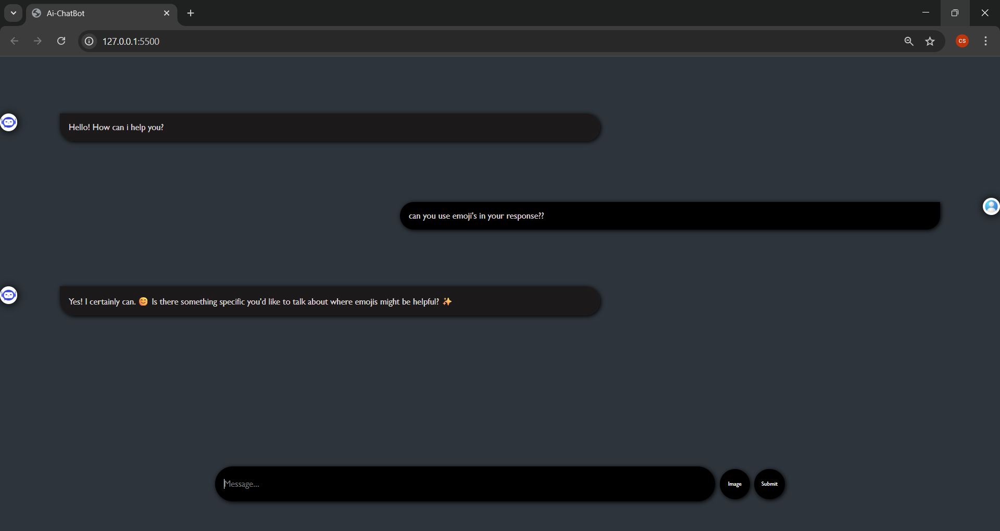
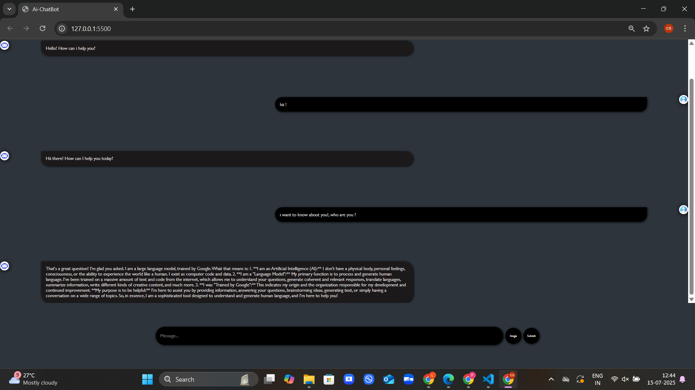

# 🤖 AI Chatbot – Real-Time Text & Image Interaction

This is a simple yet smart AI-powered chatbot that can respond to **text** and **image inputs** in real-time. It's designed to feel like you're chatting with a modern AI assistant – clean, fast, and easy to use.

---

## 🌟 Features

- 💬 Send text messages and get AI-generated replies
- 🖼️ Upload an image and get responses based on its content
- ⚡ Auto-scrolls as the chat updates
- 📱 Fully responsive for desktop and mobile
- 🧠 Uses **Google Gemini API** for intelligent response generation

---

## 🛠️ Tech Stack

- **HTML / CSS / JavaScript** – for the frontend
- **Google Gemini API** – handles AI responses
- **Responsive UI** – works on all screen sizes

---

## 📷 Screenshot

*(Add a screenshot here showing text + image conversation)*

---

## 🚀 How to Use

1. Clone the repo
2. Open `index.html` in your browser
3. Type a message or upload an image
4. Get an AI-powered response instantly!

> ⚠️ Make sure you have access to the Gemini API and add your API key in the JavaScript file.

---

## 🤓 What I Learned

- How to integrate AI into frontend projects
- Handling **multi-modal input** (text + images)
- Making a **responsive and interactive UI**
- Understanding how AI APIs return structured data

---

## 📁 Folder Structure
📦 ai-chatbot
 ┣ 📜 index.html
 ┣ 📜 style.css
 ┣ 📜 script.js
 ┣ 📄 README.md
 ┗ 📷 chat-preview.png  ← your screenshot

